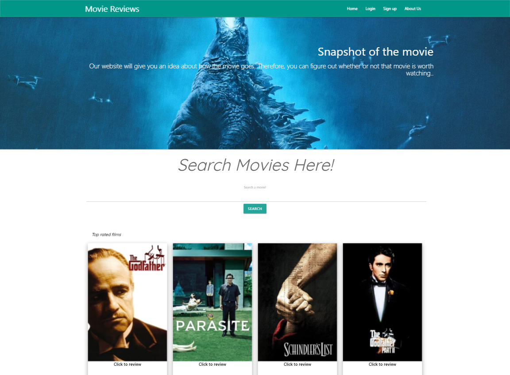

# Project 2

>Movie rating and reviewing blog.
[Click to try](https://lit-peak-86961.herokuapp.com/)

### Table of content

- [Description](##Description)
- [How to Use](##How-to-Use)
- [Technologies](##Technologies)
- [Directions for Future Development](##Directions-for-Future-Development)
- [Author Info](##Author-Info)

## Description

### Customer Story
>As a movie lover, I want to see what other movie lovers have to say movies.
I also want to be able to share my reviews on movies I feel passionate about.
So I can make good decisions about what movies are worth watching,
and help others do the same by sharing my thoughts.

We wanted to create a movie review website where users could look up any movie and see what other people have reviewed. This could help them decide to watch a movie or not.
Secondly, users can register as a member and this allows them to also add their own reviews. 

The can also go into their profile page and delete any of their reviews that they are not happy with.

[Back to the top](#Project-2)

## How to Use

This web applicaiton has been deployed on Heroku so welcome to use anytime you want.

Click to use: https://lit-peak-86961.herokuapp.com/

On the main page, if user did not login, they can click suggested movies or search their own favourites to check the reviews and rating of the others. But they can't leave a review unless they are loged in.

Click **Signup** to sign up a account. 

After sign up finished, click **Login** to log in. When login button changed into user name, the user is loged in. 

Click **Logout** to log out.

When loged in, there will be a form on movie review page, leave a comment, select star rating, and click **Submit** to leave a review for the current movie.

Click user icon in Navbar to go to profile page. User can delete reviews of their own.

Click **About Us** to know about the developers of this app!

[Back to the top](#Project-2)

## Technologies

- Node.js
- MYSQL
- JQuery
- Javascript
- MVC structure
- CRUD
- AJAX
- Heroku
- HTML
- CSS
- Materialize
- The Moviedb API 

Npm used:

- Express.js
- Sequalize
- Handlebars
- Passport
- Bcryptjs
- Path

[Back to the top](#Project-2)

## Directions for Future Development

The CRUD is missing Update, this feature should be added in the future.

Search result list is needed so that user can choose from a list of ambigurous search result. Also for review page, a "like" button is needed for each review to add more interaction between users.

[Back to the top](#Project-2)

## Author Info

The design is accomplished by following developers from the same Web Dev Bootcamp of USYD.

- Tonnette - [Github](https://github.com/Tonnette)
- Andy - [Github](https://github.com/AndyYuan-Oni)
- Jesse - [Github](https://github.com/mjg1)

[Back to the top](#Project-2)

